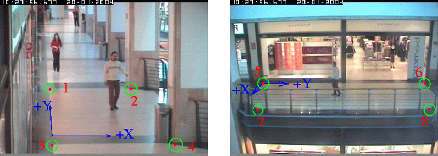

# TrackTion
Разработка системы наблюдения за людьми по распределённому набору видеокамер с использованием технологий машинного зрения

## CAVIAR
На данный момент работаем с видеоматериалами, взятыми [отсюда](http://homepages.inf.ed.ac.uk/rbf/CAVIARDATA1/). 
Размер фрейма (384, 288).



Соответствующая таблица перевода координат:

Point | (Col,Row) (pixels) | (X,Y) (cm) | 
--- | --- | --- |
1   | (91, 163) | (000, 975) |
2   | (241, 163) | (290, 975) |
3   | (98, 266) | (000, -110) |
4   | (322, 265) | (290, -110) |
5   | (60, 153) | (000, 000) |
6   | (359, 153) | (000, 975) |
7   | (50, 201) | (382, 098) |
8   | (367, 200) | (382, 878) |

## Darknet

Откуда брал код:
1) https://cloudxlab.com/blog/setup-yolo-with-darknet/
2) https://cloudxlab.com/blog/object-detection-yolo-and-python-pydarknet/

### Darknet repo

При необходимости:

```
git clone https://github.com/pjreddie/darknet
```

Затем все файлы можно будет скачать или так:
```python
import urllib.request

url = 'https://pjreddie.com/media/files/yolov3.weights' # Необходиый URL
filename = 'yolo3.weights.txt'

urllib.request.urlretrieve(url, filename)
```

Или так:
```python 
wget https://pjreddie.com/media/files/yolov3.weights
```
